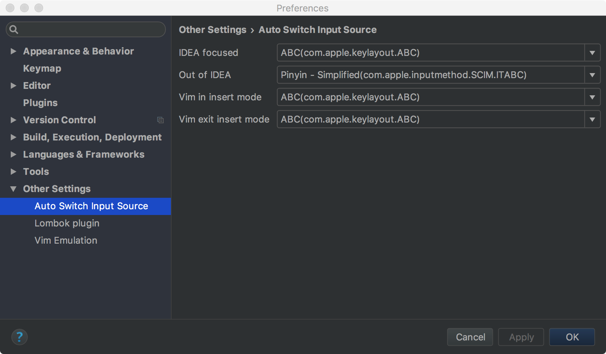

# IntelliJ IDEA Auto Switch Input Source / IDEA自动切换输入法

# Introduction 介绍
An Idea plugin helps you switch input source automatically

一个可以帮你自动切换输入法的IDEA插件

# Usage 使用

1. Install this plugin from IDEA plugin repository or download the plugin zip file from [Release](https://github.com/rieonke/idea-auto-switch-im/releases) page,
and then install from disk

2. Setting the specified input source from preferences `Preferences` -> `Other Settings` -> `Auto Switch Input Source` (default `ABC`)




3. There are four setting options now:

    `IDEA focused` => Idea IDE window get focused,eg. switch to IDEA from other app.
    
    `Out of IDEA` => Leaving Idea IDE to other apps.
    
    `Vim in insert mode` => In IdeaVim mode change to `insert` mode.
    
    `Vim exit insert mode` => In IdeaVim mode exit `insert` mode to `normal` or `visual` mode.

---
1. 从IDEA的插件仓库直接安装；或者从Release页面上下载最新版本的插件ZIP压缩包，从硬盘安装。

2. 在IDEA设置中找到 `Preferences` -> `Other Settings` -> `Auto Switch Input Source`


3. 设置参数选项如下：

    `IDEA focused` => Idea 获得焦点，例如从其他应用切换到Idea
    
    `Out of IDEA` => 离开Idea，例如从Idea切换到其他应用
    
    `Vim in insert mode` => IdeaVim 中进入 `插入` 模式.
    
    `Vim exit insert mode` => IdeaVim 中退出 `插入` 模式 到`正常`模式或者`可视`模式.

# Build 编译

1. Clone this repo
```bash

git clone https://github.com/rieonke/idea-auto-switch-im.git

```

2. Build Native Module

```bash

cd idea-auto-switch-im
cd native-src

xcodebuild -scheme ImSelect DSTROOT="./" archive

```

3. Then you will find a new directory in `native-src` named `usr`,
copy the `ImSelect` bin file to `src/main/resources/native` path

4. Build plugin with gradle

```bash

gradle buildPlugin

```

---

1. 克隆这个仓库到本地
```bash

git clone https://github.com/rieonke/idea-auto-switch-im.git

```

2. 编译安装本地二进制工具

```bash

cd idea-auto-switch-im
cd native-src

xcodebuild -scheme ImSelect DSTROOT="./" archive

```

3. 你将会在 `native-src` 下找到一个名为 `usr` 的文件夹,
找到文件夹下的 `ImSelect` 二进制文件到 `src/main/resources/native`

4. 编译插件

```bash

gradle buildPlugin

```

# License 协议

GPLv3
